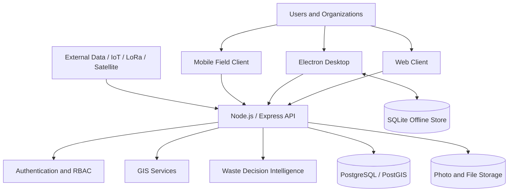
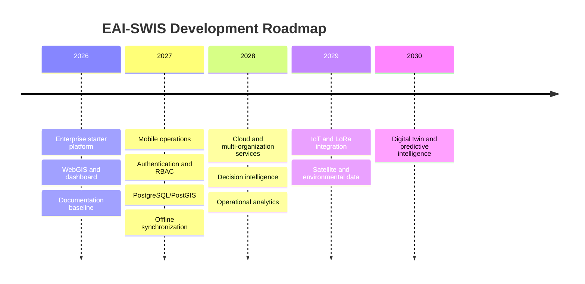

<div align="center">

# EAI-SWIS

## Earth Alert Intelligence – Smart Waste Intelligence System

**Enterprise Geospatial Intelligence Platform for Spatial Waste Management and Waste Decision Intelligence**

[](CHANGELOG.md)
[](#technology-stack)
[](#technology-stack)
[](#technology-stack)
[](LICENSE)
[](#project-status)

</div>

---

## Overview

**EAI-SWIS** is an enterprise-oriented geospatial intelligence platform for smart waste management. It integrates WebGIS, operational dashboards, mobile field reporting, GPS, spatial databases, photographs, route information, and decision-support services into a unified architecture.

The current repository is an **enterprise starter implementation**. It includes the user-interface foundation, WebGIS components, Electron desktop runtime, Node.js API foundation, and database architecture required for subsequent production modules.

> **Important:** Dashboard values and selected operational records may currently be demonstration data. Authentication, PostgreSQL/PostGIS deployment, offline synchronization, production decision logic, and organization-level governance must be completed before production use.

## Strategic objectives

- Convert field observations into spatially referenced operational intelligence.
- Support illegal-dumping reports, collection monitoring, inspections, and incident verification.
- Provide management dashboards and GIS views for local government and environmental agencies.
- Enable offline-first desktop and field workflows.
- Establish a modular foundation for AI, IoT, LoRa, satellite data, and environmental digital twins.
- Support research demonstration, government assessment, and future commercial deployment.

## Core capabilities

| Domain | Current/Target capabilities |
|---|---|
| WebGIS | Interactive map, base maps, GeoJSON, layers, spatial visualization |
| Smart Waste | Incident reports, illegal dumping, classification, quantity, urgency |
| Field Operations | GPS, photos, mobile reporting, field verification |
| Dashboard | KPI, statistics, maps, operational status |
| Desktop | Electron application and local workflow |
| Backend | Node.js and Express API foundation |
| Data | SQLite offline target; PostgreSQL/PostGIS production target |
| Decision Support | Rules, analytics, prioritization, future predictive services |
| Integration | Mobile, Apps Script, IoT, LoRa, sensors, CCTV and external APIs |

## Architecture



Detailed architecture: [docs/02-System-Architecture.md](docs/02-System-Architecture.md)

## Technology stack

| Layer | Technology |
|---|---|
| Frontend | HTML5, CSS3, JavaScript ES Modules |
| Desktop runtime | Electron |
| Mapping | Leaflet |
| Backend API | Node.js, Express |
| Offline database target | SQLite |
| Production database target | PostgreSQL, PostGIS |
| Spatial formats | GeoJSON and standard web-map formats |
| Version control | Git and GitHub |
| Responsive targets | Desktop, notebook, tablet, mobile |

## Repository structure

```text
EAI-SWIS/
├── .github/
│   ├── ISSUE_TEMPLATE/
│   ├── workflows/
│   └── PULL_REQUEST_TEMPLATE.md
├── assets/
├── css/
├── database/
├── docs/
├── electron/
├── js/
├── server/
├── CHANGELOG.md
├── CODE_OF_CONDUCT.md
├── CONTRIBUTING.md
├── SECURITY.md
├── SUPPORT.md
├── index.html
├── package.json
└── README.md
```

## Quick start

### Prerequisites

- Git
- Node.js LTS
- npm
- Chrome or Microsoft Edge
- Windows 10/11 for the current desktop target

### Clone and install

```bash
git clone https://github.com/etechtelecom-prog/EAI-SWIS.git
cd EAI-SWIS
npm install
```

### Run as web

```bash
npm run web
```

### Run as Electron desktop

```bash
npm run desktop
```

### Run backend API

```bash
npm run server
```

Default health endpoint:

```text
http://localhost:3000/api/v1/health
```

Use the exact scripts defined in `package.json`. See [Installation Guide](docs/07-Installation-Guide.md).

## Project status

| Module | Status |
|---|---|
| Enterprise starter UI | Available |
| WebGIS foundation | Available |
| Electron desktop foundation | Available |
| Node.js API foundation | Available |
| Demonstration dashboard | Available |
| SQLite offline synchronization | In development |
| PostgreSQL/PostGIS production data layer | Planned |
| Authentication and RBAC | Planned |
| Mobile operational integration | In development |
| AI decision intelligence | Planned |
| IoT and LoRa integration | Planned |
| Production security hardening | Required before deployment |

## Documentation

1. [Project Overview](docs/01-Project-Overview.md)
2. [System Architecture](docs/02-System-Architecture.md)
3. [Software Requirements Specification](docs/03-Software-Requirements-Specification.md)
4. [Software Architecture Document](docs/04-Software-Architecture-Document.md)
5. [Database Design](docs/05-Database-Design-Document.md)
6. [API Specification](docs/06-API-Specification.md)
7. [Installation Guide](docs/07-Installation-Guide.md)
8. [Deployment Guide](docs/08-Deployment-Guide.md)
9. [User Manual](docs/09-User-Manual.md)
10. [Administrator Manual](docs/10-Administrator-Manual.md)
11. [Security Architecture](docs/11-Security-Architecture.md)
12. [Developer Guide](docs/12-Developer-Guide.md)
13. [Test Plan](docs/13-Test-Plan.md)
14. [Maintenance Guide](docs/14-System-Maintenance.md)
15. [Roadmap](docs/15-Roadmap.md)

## Deployment model

```text
Public demonstration
  GitHub Pages or static web hosting

Production frontend
  Managed web hosting / reverse proxy / HTTPS

Production API
  Node.js service on VPS, container platform, or managed runtime

Production database
  PostgreSQL + PostGIS

Desktop distribution
  Signed Electron installer through controlled releases
```

GitHub Pages is suitable only for the static demonstration layer. It does not execute Node.js, Electron, or SQLite server functions.

## Governance and compliance

Production deployments should include:

- Role-based access control
- Audit logging
- Backup and restoration
- Personal-data minimization and retention policy
- HTTPS and secure secret management
- Vulnerability management
- OWASP-aligned application security controls
- Organization-specific data governance and PDPA assessment

## Roadmap



## Contributing

See [CONTRIBUTING.md](CONTRIBUTING.md). Contributions should use feature branches, clear commit messages, reviewable pull requests, and tests appropriate to the change.

## Security

Do not publish credentials, access tokens, private endpoints, personal records, or real operational secrets in this repository. Security reports should follow [SECURITY.md](SECURITY.md).

## License

The repository currently uses the MIT License. The EAI name, logos, visual identity, and trademarks are not automatically granted by the software license unless expressly stated.

## Citation

```bibtex
@software{choomkong_eai_swis_2026,
  author  = {Apichat Choomkong},
  title   = {EAI-SWIS: Earth Alert Intelligence – Smart Waste Intelligence System},
  year    = {2026},
  version = {1.0.0-alpha},
  url     = {https://github.com/etechtelecom-prog/EAI-SWIS}
}
```

## Maintainer

**Dr. Apichat Choomkong**  
Earth Alert Intelligence (EAI)  
Email: etechtelecom@gmail.com
