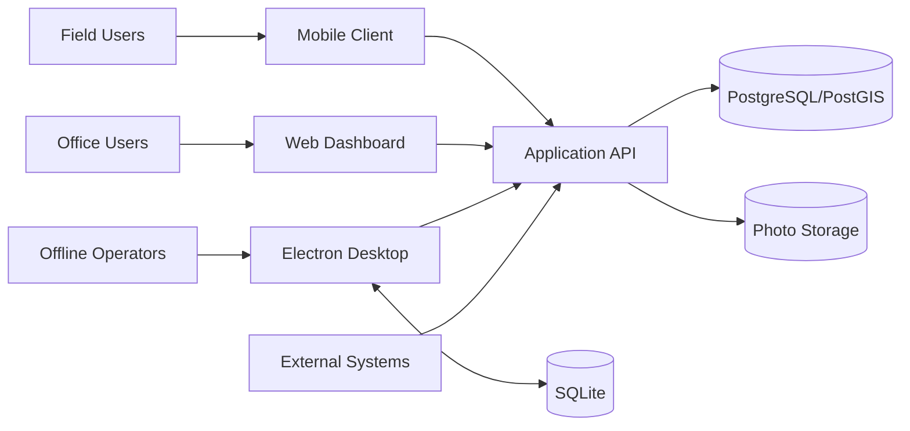

# 02. System Architecture

## Architectural style

EAI-SWIS uses a modular, layered architecture:

1. Presentation layer: web, desktop, and mobile clients.
2. Application layer: Node.js/Express services.
3. Domain layer: waste management, GIS, workflow, and decision rules.
4. Data layer: SQLite for offline use and PostgreSQL/PostGIS for production.
5. Integration layer: sensors, LoRa, external APIs, satellite data, and file storage.

## Context diagram

## Design principles

- Offline-first where field connectivity is unreliable.
- API-first for integration and modular development.
- Spatial-by-design for location-linked operations.
- Least privilege for security.
- Auditability for government and enterprise use.
- Replaceable modules to avoid vendor lock-in.
- Explicit separation between demonstration and production data.

## Production considerations

Use HTTPS, an authenticated API, environment-managed secrets, PostgreSQL/PostGIS, object storage, backups, centralized logs, health monitoring, and controlled releases.
